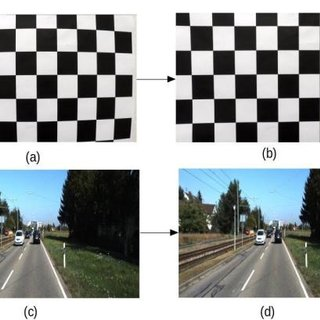
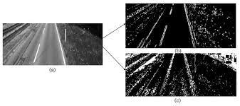
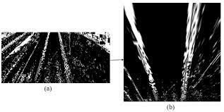
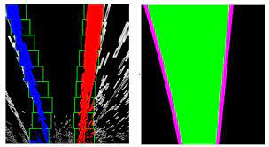
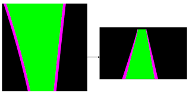

# A Computer Vision based Lane Detection Approach
Şerit tespiti güvenli bir otonom sürüş gerçekleştirilmesi için önemli algoritmalardan biridir. Fakat güneş ışığı, yağmur, gölge, ışık yansıması gibi problemler şerit çizgilerinin görünürlüğünü olumsuz etkilemektedir. Giriş görüntüsü ortam şartlarının değişmesi sebebiyle gürültülü hale gelebilir. 
Bilgisayarlı görü tabanlı teknolojinin gelişmesiyle kamera popüler bir sensör haline gelmiştir. Bu çalışmada önerilen sistem  bilgisayarlı görü tabanlı teknolojiler kullanılarak şerit çizgilerini tespit eder. Çalışmada incelenen yöntem temel olarak üç adımdan oluşmaktadır: 
1-Görüntü  üzerindeki gürültüyü azaltmak amacıyla yapılan ön işleme  
2-Şerit çizgilerinin paralellik özelliğinden yararlanmak amacıyla kullanılan perspektif haritalama (IPM) 
3-Sliding window yöntemiyle şerit eğrisi uydurma 

## Şerit Tespiti İçin Önerilen Yöntem  Aşamaları  

**Kamera Kalibrasyonu** 

Kamera görüntülerini analiz etmenin ilk adımı kalibrasyondur. Kameradan alınan görüntüler kesin doğrulukta olmadığından görüntü üzerinde doğru analizler yapabilmek için ilk önce kamera kalibre edilip görüntü üzerindeki bozukluklar giderilmelidir. Kamera kalibrasyonu, kamera matrisi ve bozulma katsayıları kullanılarak satranç tahtası görüntüleri üzerinden hesaplanmıştır.

 

**Preprocessing (Ön İşleme)** 

Bu aşamada şerit tespit işleminin güneş ışığı, yağmur, gölge gibi olası bozucu etkilere rağmen doğru bir şekilde çalışması için giriş görüntüsü iyileştirilerek sonraki aşamalarda bu bozucu etkilerden etkilenmemesi amaçlanmıştır. Temel amaç görüntü üzerindeki kontrastı artırmak, gürültüyü azaltmak ve gelen giriş görüntüsü için bir kenar tespiti yapmaktır.

**İlgili Alan Belirleme** 

Görüntüde şeritleri içermeyen, istenmeyen bölgeyi ortadan kaldırmak için ROI denilen bir ilgi alanı belirlenmiştir ve sonraki aşamalardaki işlemler bu ilgi alanı içerisinde bulunan şeritler üzerinden yapılmıştır.

**Eşikleme**

Bu aşamada Sobel filtresi ve HLS renk uzayı kullanılarak giriş görüntüsü ikili görüntüye dönüştürülür. HLS (Hue Saturation Lightness) renk kanalı, yol renginin çok parlak veya çok açık olduğu durumları işlemek için kullanılır. HLS renk uzayı tüm renkleri ton, doygunluk ve açıklık değerlerine ayırdığı için daha iyi renk kontrastı elde edilir. Bu da şeritleri ayırt etmede iyi bir sonuç edilmesine yardımcı olur.
Son ikili görüntüde gradyan ve HLS (renk) eşikleme bir araya getirilir.

 

**Perspektif Dönüşüm**

Kamera açısından bakıldığında şerit çizgileri ufukta birleşiyormuş gibi görünür. Bu açıdan kıvrımlı yolları algılamak daha zordur. Şerit çizgilerinin paralellik özelliğinden yararlanmak amacıyla görüntüye perspektif dönüşüm uygulanarak kuşbakışı bir görünüm elde edilir. Böylece şerit çizgilerini izole etmek ve eğriliği tespit etmek kolaylaşır.

 

**Kayan Pencere ile Arama**

Şerit çizgisi piksellerini tanımak için x ve y piksel konumları ikinci dereceden bir polinom eğrisine uyacak şekilde kullanılır. Kayan pencere yönteminde görüntü soldan sağa ve aşağıdan yukarıya pencere şablonu ile taranır. Her arama yapıldığında potansiyel şerit pikselleri kaydedilir. Bu piksellerin ortalama konumu bi sonraki kayan pencerenin merkezi olur. Görüntünün tamamındaki şeritler için iyi piksel adayları elde edildiğinde bunlara ikinci dereceden bir polinom yerleştirilir. 

 

Şerit çizgileri belirlendikten sonra şeritlerin resimde doğru bir şekilde görüntülenebilmesi için dönüşüm matrisi ile çarpıtma işlemi yapılır. 

 

**Sonuç:**

Deneysel sonuçlar önerilen tekniğin hava koşulları ve çeşitli aydınlatma gibi farklı ortam koşullarında şerit çizgilerini doğru bir şekilde tespit ettiğini göstermektedir.
Sistemin gücünü ölçmek için yöntemin doğruluğu da KITTI veri setinden 175 görüntü üzerinde tahmin edilmektedir. 175 görüntü arasından 147 görüntüdeki şeritler doğru, 9 undaki şeritler yanlış algılanmıştır. Önerilen sistemin performansı Tablo-1'de gösterilmiştir. 

